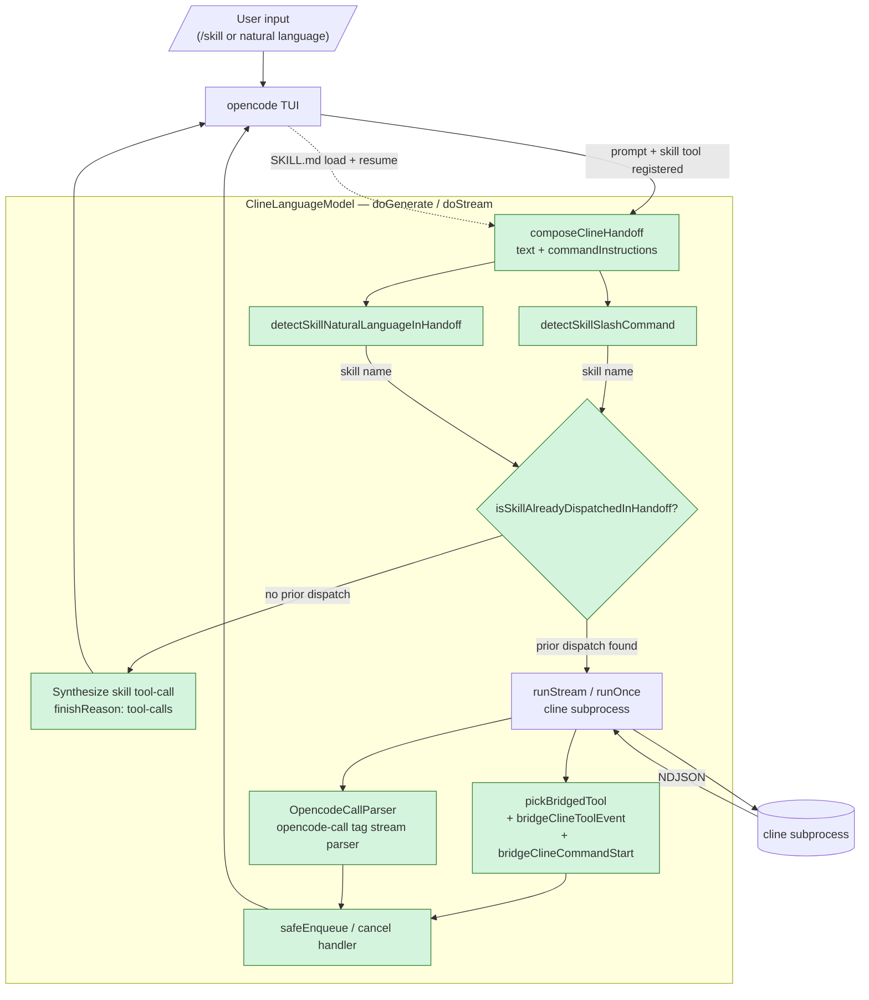

# @opencode-anycli/provider-cline-cli

A Vercel AI SDK v3 `LanguageModelV3` adapter that delegates generation to a
locally installed `cline` CLI subprocess. opencode-anycli wires this adapter
into opencode so a single `opencode` session can drive any model `cline` is
configured for — while still surfacing cline's tool activity (file reads,
shell commands, edits, searches, …) as first-class entries in opencode's UI.

```ts
import { createCline } from "@opencode-anycli/provider-cline-cli"

const provider = createCline()
const model = provider.languageModel("default")
```

---

## Architecture

```text
┌─────────────────────────────────────────────────────────────────┐
│  opencode TUI / session                                          │
│  ├─ slash commands (/karpathy, /code-review, …)                  │
│  ├─ V3 stream consumer (text-delta, tool-call, tool-result, …)   │
│  └─ tool registry (read, edit, write, bash, grep, glob, skill, … │
└──────────────────────────▲──────────────────────────────────────┘
                           │  LanguageModelV3 contract
┌──────────────────────────┴──────────────────────────────────────┐
│  ClineLanguageModel  (this package)                              │
│                                                                  │
│  composeClineHandoff() ──▶  prompt + protocol + commandInstr     │
│         │                                                        │
│         ├─ maybeBypassForSkillSlashCommand()                     │
│         │     └─ short-circuits cline when prompt contains a     │
│         │        "Run the `X` skill workflow" directive AND      │
│         │        skill is registered → emits skill tool-call     │
│         │        directly, opencode loads SKILL.md content       │
│         │                                                        │
│         ▼                                                        │
│  runStream() / runOnce() (cline subprocess)                      │
│         │                                                        │
│         ├─ NDJSON splitter / parser                              │
│         ├─ OpencodeCallParser    ───▶ structured tool-calls      │
│         │   (parses <opencode-call name="task|skill"/> tags)     │
│         ├─ ClineToolBridge       ───▶ structured tool-calls      │
│         │   (maps cline's native tools onto opencode tools)      │
│         └─ usage harvesting (banner + persisted task state)      │
└─────────────────────────────────────────────────────────────────┘
                           │  spawn
                           ▼
                    cline CLI subprocess
```

### Flow diagram



### Why skill bypass exists

opencode registers a `skill` tool but cline ignores it — cline's own system
prompt wins and it never emits a skill tool-call, so `SKILL.md` never
loads. The adapter detects the user's skill intent (slash command or
natural-language phrasing) and synthesizes the `skill` tool-call on
cline's behalf, so opencode actually loads the skill before resuming
cline.

### Component summary

| Module | Role |
|---|---|
| `cline-tool-bridge.ts` (new) | Maps every cline native tool spelling (`readFile`/`execute_command`/… — 50+ aliases) to opencode's V3 tool registry. Unknown tools surface as a `cline:<name>` text marker. |
| `opencode-call-parser.ts` (new) | Skill-intent detectors (slash command + natural language), `<opencode-call>` streaming tag parser, and the dispatch loop guard. |
| `cline-handoff.ts` (extended) | Extracts `<command-instruction>` blocks from the prompt into `ClineHandoffResult.commandInstructions[]` so the language-model layer can decide on the slash-command bypass. |
| `cline-runner.ts` (extended) | `pickBridgedTool` routes cline NDJSON (`say.tool` / `say.command` / `ask.command_output`) into V3 tool-call + tool-result events. `pendingBashCall` race-guard closes orphaned bash calls on next-bash arrival and on stream end. |
| `language-model.ts` (extended) | `maybeResolveSkillBypass{,Stream}` short-circuits cline when an intent is detected (and the same skill hasn't already loaded). `safeEnqueue` + `cancel` handler eliminate the reader-cancel race on the V3 stream. |

### Feature summary (1 line each)

1. **Skill slash-command bypass** — turns `/karpathy` etc. into a direct `skill` tool-call before cline is spawned, so opencode actually loads `SKILL.md`.
2. **Skill natural-language bypass** — same dispatch from prose ("X 스킬로 분석", "use X skill"), gated by a closed-world catalog so unregistered names never fire.
3. **Loop guard** — once a skill has been loaded in the conversation, the bypass refuses to dispatch the same skill again (name-specific; chaining different skills still works).
4. **cline native tool bridge** — surfaces cline's `readFile` / `execute_command` / `search_files` / `list_files` / … as first-class opencode tool entries in the UI.
5. **Forward-compatible unknown-tool fallback** — new cline tool names ship as a `cline:<name>` text marker so the activity is still visible without a provider release.
6. **Stream cancel-safe pipeline** — reader cancellation / GC tear down the cline subprocess cleanly and downstream `controller.enqueue` calls become no-ops.

---

## Implementation scope

### Mode coverage

| Mode | Status | Notes |
|---|---|---|
| `subprocess` | ✅ default | `cline --json --yolo --act <prompt>`. Large prompts spill to a `0600` temp file (see `prompt-tempfile.ts`) to dodge Linux `MAX_ARG_STRLEN`. |
| `acp` | ✅ opt-in | `cline --acp` over Agent Client Protocol stdio. Tool bridging applies. |
| `passthrough` | 🚧 planned | Would call the model directly using cline credentials. Not implemented. |

### cline → opencode tool bridge

`packages/provider-cline-cli/src/cline-tool-bridge.ts` maps cline's
NDJSON tool events onto opencode's V3 tool registry. The alias map
recognises **every cline tool spelling we have observed across releases**
(camelCase ↔ snake_case ↔ legacy aliases); unknown tools fall through
as `cline:<name>` so the activity is visible even before the table is
updated for a future cline release.

| cline tool (aliases) | opencode tool | input shape forwarded | result body forwarded |
|---|---|---|---|
| `readFile` / `read_file` / `read` | `read` | `filePath`, `offset`, `limit` | `{ ok, filePath }` (no `output` — opencode re-runs read to drive LSP) |
| `write_to_file` / `writeToFile` / `write_file` / `newFile` / `createFile` / `write` | `write` | `filePath`, `content` | `{ ok, filePath }` |
| `replace_in_file` / `replaceInFile` / `apply_diff` / `applyDiff` / `edit_file` / `patch_file` / `edit` | `edit` | `filePath`, `diff` | `{ ok, filePath }` |
| `execute_command` / `executeCommand` / `exec_command` / `bash` / `shell` / `command` / `run_command` (also `say.command` raw text) | `bash` | `command` | `{ ok, stdout, exitCode? }` (paired from `ask.command_output`) |
| `search_files` / `searchFiles` / `search` / `grep` / `ripgrep` | `grep` | `pattern`, `path`, `include?` | `{ ok, output? }` (the search hits body) |
| `list_files` / `listFiles` / `ls` / `list_dir` / `list_directory` / `glob` | `glob` | `pattern` (recursive→`<path>/**`) | `{ ok, output? }` (the listing) |
| `web_fetch` / `webFetch` / `fetch_url` / `fetch` / `webfetch` | `webfetch` | `url` | `{ ok }` |
| `web_search` / `webSearch` / `websearch` | `websearch` | `query` | `{ ok }` |
| *(unknown)* | `cline:<original-name>` | passthrough of primitive/JSON-clonable fields (minus `tool`) | `{ ok }` |

#### `providerExecuted` policy

cline already ran the tool, so bridged tool-calls are forwarded with
`providerExecuted: true` and a result body — opencode shows them in the
UI but does NOT re-execute. The single exception is **`read`**: opencode's
read handler runs `LSP.touchFile(filePath)` as a side effect, and that
side effect is worth re-running. So `read` is forwarded unflagged and
opencode runs its own read tool to keep LSP activation working.

### Skill bypass — sources

Two pre-cline detectors feed the same dispatch path. Slash takes
priority (deterministic structured directive) and natural-language
fires when no slash directive is present.

`providerMetadata.cline.skillBypassSource` is `"slash"` or
`"natural-language"`; both also set `skillSlashBypass` to the dispatched
skill name (legacy field kept for downstream consumers).

#### Slash-command bypass

`packages/provider-cline-cli/src/opencode-call-parser.ts::detectSkillSlashCommand`
inspects every `<command-instruction>` block in the prompt for the
phrase

```
Run the `<skill-name>` skill workflow
```

When matched AND `skill` is in `options.tools`, `language-model.ts::
maybeBypassForSkillSlashCommand{,Stream}` short-circuits the cline
subprocess and emits a single V3 stream:

```jsonc
// stream-start
// response-metadata
{ "type": "tool-call", "toolName": "skill", "input": "{\"name\":\"<skill-name>\"}" }
{ "type": "finish", "finishReason": { "unified": "tool-calls", "raw": "skill-slash-bypass" } }
```

`providerMetadata.cline.skillSlashBypass` is set to the dispatched
skill name for telemetry. opencode runs the skill, injects `SKILL.md`
content as the next turn's tool-result, and the conversation resumes
through cline normally — only now cline has the loaded skill rules
in its context.

#### Natural-language bypass

`detectSkillNaturalLanguage` brings the same dispatch up to the level
of bare prose. When the user types something like:

```
karpathy-guidelines 스킬로 분석해줘
use the code-review skill
dead-code-finder 적용해줘
```

…the detector matches a skill name from the `<available_skills>`
catalog adjacent to a trigger token (`use`/`apply`/`run`/`invoke`,
Korean `로`/`을`/`스킬` patterns, …) and dispatches the same skill
tool-call. Trigger patterns are deliberately conservative:

- An adjacent trigger verb / particle is required — `tell me about
  the X skill` does NOT fire (no imperative tail).
- Closed-world: only names present in the prompt's `<available_skills>`
  catalog can match. `phantom-skill 적용해줘` is a no-op when
  `phantom-skill` isn't registered.
- Longest-id-first match — `code-review` wins over a bare `code` when
  both are catalogued and both appear in the prompt.

### `<opencode-call>` protocol

For cline builds that DO honor user-task directives, the adapter
optionally appends an `[OPENCODE_CALL_PROTOCOL]` section to the handoff
when `task` and/or `skill` is registered. cline-compliant models emit:

```text
<opencode-call name="task">{"subagent_type":"<agent>","description":"<3-5 words>","prompt":"<text>"}</opencode-call>
<opencode-call name="skill">{"name":"<skill-name>"}</opencode-call>
```

The parser strips these tags from the text stream and forwards them as
V3 tool-call parts. `finishReason` flips to `"tool-calls"` so opencode
dispatches them and the multi-turn loop continues.

Note: the GaussO3-CLI custom cline build ignores this protocol. The
slash-command bypass above is the durable path on that model; the
protocol is a best-effort overlay for cooperative builds.

---

## Interface surface

### Public exports

| Symbol | From | Purpose |
|---|---|---|
| `createCline(opts?)` | `index.ts` | Factory that returns an AI SDK provider. |
| `ClineLanguageModel` | `language-model.ts` | The `LanguageModelV3` implementation. |
| `composeClineHandoff(input)` | `cline-handoff.ts` | Builds the cline subprocess prompt. Returns `{ text, diagnostics, commandInstructions }`. |
| `runStream(input)` | `cline-runner.ts` | Streaming runner (low-level). |
| `runOnce(input)` | `cline-runner.ts` | Buffered runner (low-level). |
| `bridgeClineToolEvent(payload)` | `cline-tool-bridge.ts` | Translate a cline `say.tool` JSON body to a bridged opencode event. |
| `bridgeClineCommandStart(text)` | `cline-tool-bridge.ts` | Translate a cline `say.command` shell line to a bridged `bash` call. |
| `buildCommandOutputResult(out, exitCode?)` | `cline-tool-bridge.ts` | Format the matching tool-result body. |
| `resolveOpencodeTool(clineName)` | `cline-tool-bridge.ts` | Look up the opencode tool name for any cline alias. |
| `OpencodeCallParser` | `opencode-call-parser.ts` | Streaming `<opencode-call>` tag parser. |
| `detectSkillSlashCommand(instr)` | `opencode-call-parser.ts` | Extract the skill name from a `Run the X skill workflow` directive. |
| `SUPPORTED_OPENCODE_CALL_TOOLS` | `opencode-call-parser.ts` | Allow-list (`task`, `skill`) for protocol dispatch. |

### Environment variables

| Variable | Purpose |
|---|---|
| `OPENCODE_ANYCLI_CLINE_BIN` | Override the cline binary path. |
| `OPENCODE_ANYCLI_CLINE_NDJSON_LOG` | Append every raw NDJSON line from cline to this file (diagnostics). |
| `OPENCODE_ANYCLI_PROMPTLOG` | Append every prompt + diagnostics to this file. |
| `OPENCODE_ANYCLI_USAGELOG` | Append every usage mapping (raw → V3) to this file. |
| `OPENCODE_ANYCLI_TTY` | `0` to disable inherited stdin (default: inherit). |
| `OPENCODE_ANYCLI_ARGV_LIMIT` | Bytes; force prompt-file spill when handoff exceeds this size. |
| `DEBUG` | `1` to mirror cline NDJSON and stderr to the provider's stderr. |

### Provider options (`ClineProviderOptions`)

| Field | Default | Notes |
|---|---|---|
| `mode` | `"subprocess"` | `"acp"` opt-in transport; `"passthrough"` planned. |
| `command` | `"cline"` | Resolved via `PATH`. Overridable via env var above. |
| `timeoutMs` | `3_600_000` (1 hour) | Subprocess kill after this many ms. |
| `extraArgs` | `[]` | Appended after `--json --yolo --act`. |
| `cwd` | (inherit) | Working directory. |
| `env` | `{}` | Merged into the spawned process env. |

---

## Forward compatibility

cline's tool inventory has changed across releases (camelCase ↔ snake_case
mixed, additions, renames). The adapter is designed so that **a new cline
version doesn't require a provider release**:

1. `CLINE_TO_OPENCODE_ALIASES` accepts any spelling we've observed; new
   ones can be added without touching the runner or language-model.
2. Unknown cline tools fall through as `cline:<original-name>` —
   activity remains visible in the opencode UI even if a new tool isn't
   in the alias map yet.
3. NDJSON parsing is schema-tolerant: each field is fetched defensively
   and missing fields are absent rather than synthesized. cline can add
   new fields freely; we ignore what we don't recognise.
4. Both the legacy event schema (`task_started` / `say.*` / `ask.*`)
   and the current schema (`hook_event` + `agent_event.*` + `run_result`)
   are parsed in parallel — adding a new schema variant is additive.

---

## Per-agent permission requirement

opencode auto-enables `task` for primary agents, but `skill` is opt-in.
Add `skill: true` to the agent's `tools` whitelist in
`~/.config/opencode-anycli/opencode/agents/<agent>.md` to make slash-command
bypass and protocol dispatch actually fire:

```yaml
---
name: orchestrator
tools:
  bash: true
  read: true
  grep: true
  task: true
  skill: true
---
```

---

## Token / usage handling

The adapter normalises cline's many usage shapes into the V3
`LanguageModelV3Usage` envelope. Sources, in priority order:

1. `run_result.usage` / `agent_event.done.usage` — terminal totals.
2. `agent_event.usage` — interim cumulative snapshots.
3. `api_req_started` / `api_req_finished` — per-API-call snapshots
   (latest by timestamp; never summed — cline emits both partial and
   final variants of the same call).
4. `# Context Window Usage` banner inside `environment_details` — text
   fallback when the provider doesn't populate structured fields.
5. Persisted `~/.cline/data/tasks/<id>/ui_messages.json` and
   `api_conversation_history.json` — read after stdout closes so the
   final token count survives even when stdout omits it.
6. Char-count heuristic (`~3 chars/token`) on the assistant channel,
   only when input is known but output is zero — keeps opencode's
   context panel advancing.

`providerMetadata.cline.contextMax` is surfaced when the banner reports
a model context window; opencode renders accurate `%` even when the
static `limit.context` disagrees with cline's actual upstream model.

---

## License

MIT.
